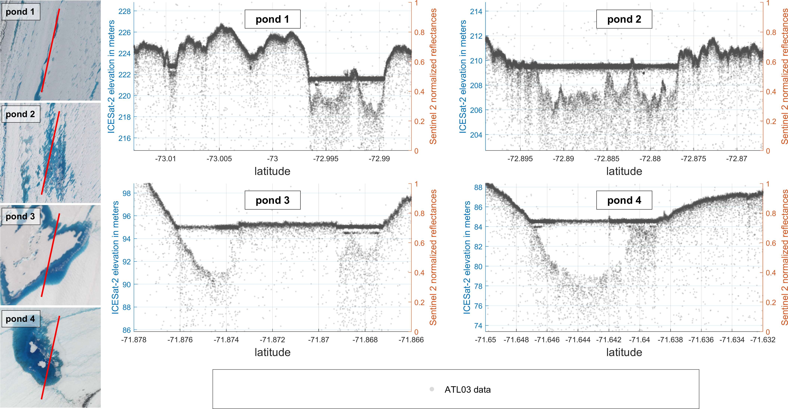
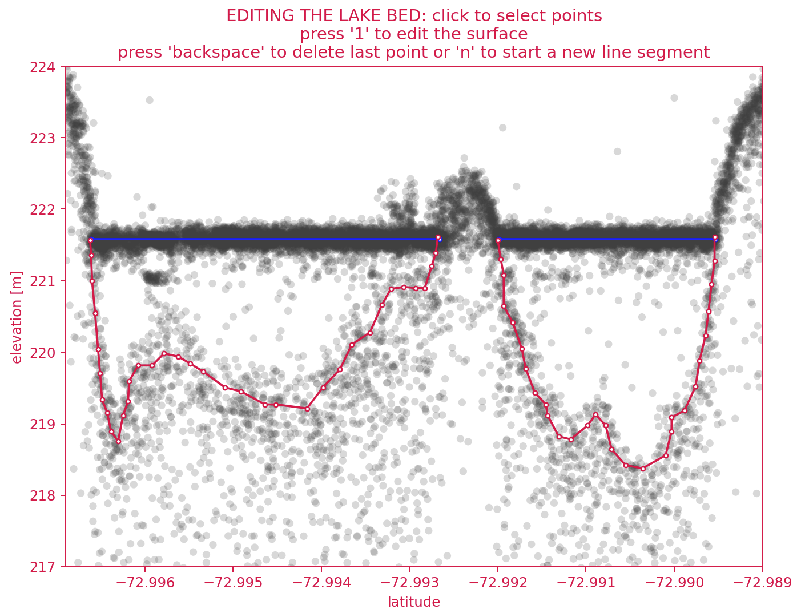
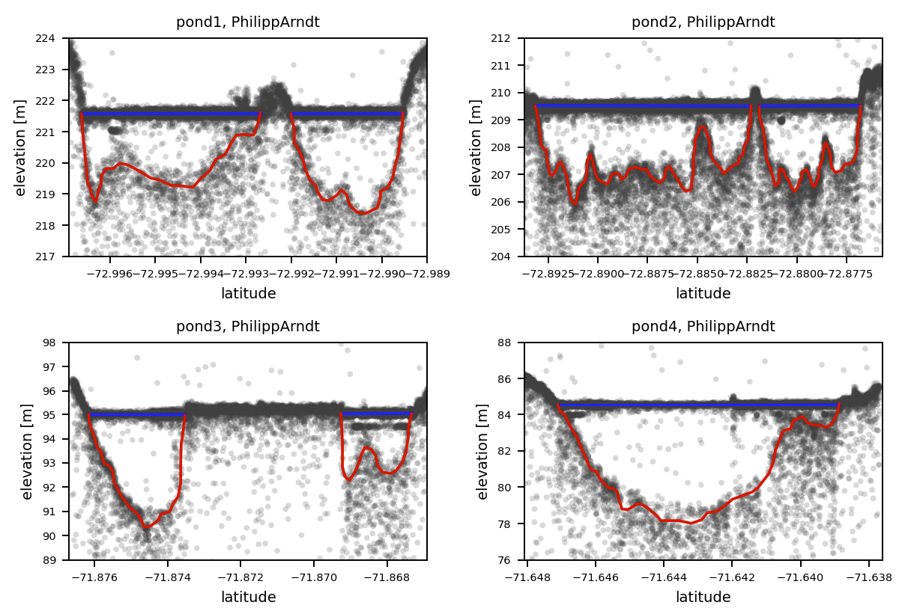

# Picking manual melt pond depths from ICESat-2 photon data plots
(a.k.a. "Science Humans vs. Science Machines")

## Background
We are working on comparing different algorithms that extract the depth of melt ponds on Amery ice shelf from ATL03 photon data (see images below). Because *humans tend to be pretty talented at recognizing patterns in such unstructured data*, we want to investigate how the algorithm estimates compare to where humans would draw the melt pond surface and bed in these data. 

  
<figure>
    
    <figcaption>Fig.1 - ICESat-2 ATL03 photon elevation data over four melt ponds on Amery Ice Shelf. (Track 0081, 2 Jan 2019, ATL03 Release 003, granule ATL03_20190102184312_00810210_003_01.h5, beam gt2l)</figcaption>
</figure>

## How YOU can help:
If you'd be willing to use about **10 minutes of your time** to help us by connecting some dots on four plots below, we'd greatly appreciated that. It's a good short distraction, and the more estimates we get, the better the data!

All you need to do is run the cells in this notebook in sequence, and trace out the surface and lake bed with line segments by clicking on the plots that are generated. The results should look something along the lines of this:
<table><tr>
<td>  </td>
<td>   </td>
</tr></table>

To start running the notebook, launch it in Binder by clicking the logo, or go to the link below. 

https://mybinder.org/v2/gh/fliphilipp/pondpicking/master?filepath=manualPondPicking.ipynb
